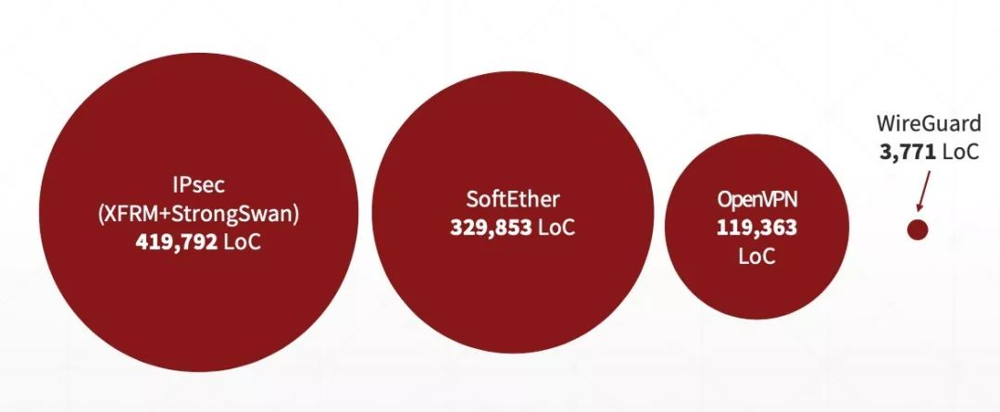
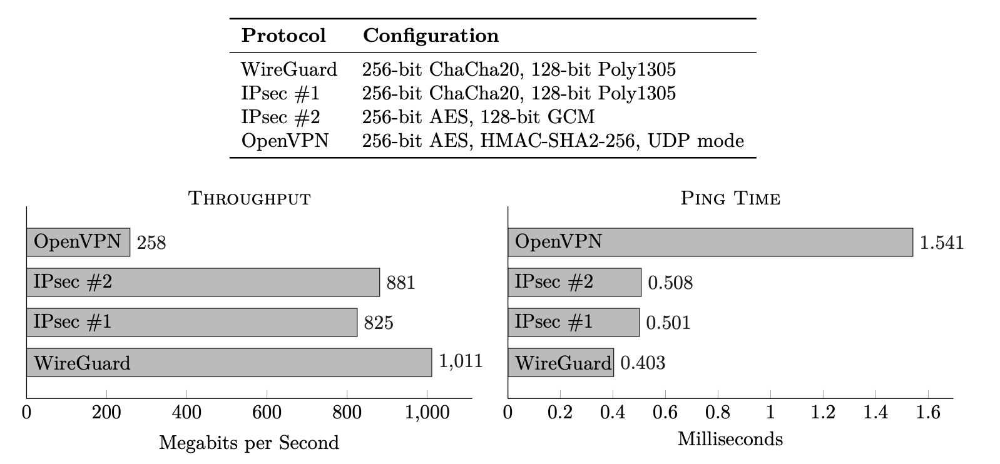
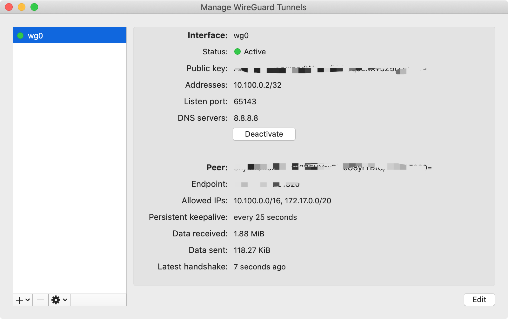

# 聊聊内核里的 WireGuard

## 为什么需要虚拟专用网

当我们需要在家中连上公司网络修复线上 bug 的时候，当拉不起专线的创业公司需要连接两个机房的服务器的时候，都需要用到虚拟专用网络<sup>1</sup>（Virtual Private Network）技术。

我们可以看一下阿里云，开启最便宜的一个 IPSec 虚拟专用网网关最低也需要 375 元一个月，而且还必须按固定带宽付费。我自己的虚机一个月都用不了 375，虚拟专用网网关却这么贵，简直是坑一个算一个。而我们在自己的服务器上搭一个 VPN 的话，费用是 ￥0/月。


## Introducing WireGuard

WireGuard 是新一代的虚拟专用网协议，相比于 IPSec 和 OpenXXX 等软件，特点是简单安全高效，总共只有不到四千行代码，由于过于优秀，已经被吸收进了 Linux 5.6+ 的内核中。

代码体积对比：




WireGuard 和其他虚拟专用网的速度对比：



一图胜千言，可以说是相当出色了吧~

鉴于我密码学学得不是很好，所以本文主要聊聊工程实现和使用，对加密算法的选择不做展开，我们假定 WireGuard 作者做了很好的选择 :P

<small>1. Virtual Private Network 一般情况下是缩写成三个字母的，但是鉴于中文互联网中，该技术常用于突破网络封锁，所以本文中使用全称以避免被河蟹吃掉。另外，本文只讨论协议本身，如果用于突破网络封锁，请责任自负。</small>

## 工作原理

WireGuard 以 UDP 实现，但是运行在第三层 —— IP 层。每个 Peer 都会生成一个 `wg0` 虚拟网卡，同时服务端会在物理网卡上监听 UDP 51820 端口。应用程序的包发送到内核以后，如果地址是虚拟专用网内部的，那么就会交给 `wg0` 设备，WireGuard 就会把这个 IP 包封装成 WireGuard 的包，然后在 UDP 中发送出去，对方的 Peer 的内核收到这个 UDP 包后再反向操作，解包成为 IP 包，然后交给对应的应用程序。

WireGuard 实现的虚拟网卡就像 `eth0` 一样，可以使用标准的 Linux 工具操作，像是 `ip`, `ifconfig` 之类的命令。所以 WireGuard 也就不用实现 QoS 之类的功能，毕竟其他工具已经实现了。这也很符合 Unix 哲学——Do one thing and do it well.

为什么 WireGuard 不实现自己的第四层协议而要用 UDP 呢？答案很现实，因为长久以来人们在第四层只有 TCP 和 UDP 两个协议，所以大多数的路由器配置都是只接受这两个协议，其他的包一律按错误处理。实际上因为这个原因，包括 http/3 在内的很多协议现在也都只能在 UDP 上实现。还好 UDP 仅仅是 IP 上一层非常薄的封装，性能损失也不大。

WireGuard 实现方式是内核模块，所以上面所说的解包封包转发等操作都是在内核实现的，基本不需要什么复制。相对而言，OpenXXX 这种在用户层实现的协议就需要在内核和用户空间之间拷贝来拷贝去，对性能是硬伤。

WireGuard 没有使用复杂的 TLS 机制，它的每个 Peer 都需要预先生成一对密钥（公钥和私钥），WireGuard 不负责密钥的分发工作。就像是 ssh 的密钥需要你自己想办法放到服务器上一样。

我们知道像是 TLS 这种协议支持各种各样的加密方式，一不留神就会出现兼容性问题。WireGuard 的解决方式也很简单，那我们只支持一种足够好的加密方式就得了，也就避免了配置问题。不得不说，这种方式确实是简单粗暴，也确实省了不少事儿。或许你会觉得这样不够灵活，但是过早优化不正是万恶之源么。

也正因为免去了协议协商、加密协商、密钥协商的过程（毕竟 WireGuard 已经帮我们做了选择），所以 WireGuard 得以实现在一个 RTT 内实现链接建立。不过在负载较重的时候，WireGuard 会要求 2 RTT 的握手。

我们知道非对称的加密是很耗费计算资源的，所以和大多数协议一样， WireGuard 也会在链接建立之后使用对称加密，这就需要在握手阶段协商出一个对称的密钥来。实际上，WireGuard 使用了两个密钥，一个用来发送，一个用来接收。

实际上 IPSec 这些复杂的握手协议让我想到了已经被废弃的 http digest 加密。虽然因为把人绕晕了，看起来很安全，但是实际上并不是完全安全，反倒是防君子不防小人。。

为了避免消息重放攻击，WireGuard 的第一个包中携带了一个加密过后的时间戳，如果收到了攻击者重放的消息，直接打开后丢弃就行了，WireGuard 不会做出任何反应。

限于篇幅，这里不展开 WireGuard 的定时器等细节了。

## 路由表


由于每个节点都有自己的公钥和私钥，实际上就建立了公钥和节点之间的一一映射。当 `wg0` 需要向外发送的包的时候，会查这个表来找到正确的公钥。当接收到一个外部的包的时候，会根据公钥来检查是否是合法的目标 IP。

当一个 Peer 发过来一个包，并且通过了验证之后，路由表就会记录下对方的外部地址，这样当需要给对方发包的时候，就可以直接通过这个地址发送了。同时，如果对方切换了网络，那么路由表就会跟着新的包更新，也就是 WireGuard 支持「漫游」, 就像是 mosh 一样。

这个路由表是用 radix tree（压缩字典树）实现的。

当一个 Peer 想把自己的所有流量都通过 WireGuard 的网路的时候，应该把 `AllowedIP` 设成 `0.0.0.0/0`（后面会讲到）。

## 连接过程


如左图所示，在正常情况下，WireGuard 只需要一个 RTT，两次握手就会建立连接状态，然后就开始传输数据了。在握手的过程中交换了对称密钥，并且在路由表中生成了对方地址。

当响应方负载过高的时候，会要求发起方再验证一次 Cookie 才接受这个请求，以避免 DDoS 攻击。

关于报文的链接建立的具体细节这里就不展开了，有时间了单独写一篇文章，或者你可以直接看 WireGuard 的论文就好了。。

## 安装和使用

由于我们现在使用的内核普遍还在 4.x，所以还是需要安装下 WireGuard 的。以 Ubuntu 18.04 为例：

```sh
sudo add-apt-repository ppa:wireguard/wireguard
sudo apt-get update
sudo apt-get install wireguard resolvconf
```

安装完成后，我们就得到了两个新命令：`wg` 和 `wg-quick`。其中 `wg` 是基础命令，`wg-quick` 是一个封装好的实用工具，实际上，他会调用 `wg` 和 `iptables` 等工作。

## 网络规划

我们使用 `10.100.0.0/16` 作为 VPN 的子网网段。服务器所在的内网网段为：`172.17.0.11/20`。服务器的公网 IP 为 `1.1.1.1`。

WireGuard 的原理是生成一个虚拟网卡，一般来说我们叫他 `wg0`，然后通过这个虚拟网卡通信。

WireGuard 的配置文件是 ini 风格的，每个配置文件都有 `[Interface]` 和 `[Peer]` 两个部分。

其中 Interface 就是自身的接口配置，比如说对于服务器来说，需要配置 ListenPort，对于服务端和客户端来说都需要配置自己的 Address。Privatekey 填写自己的私钥内容。

Peer 这部分就比较有意思了，Peer 指的是 WireGuard 连接的另一端，对于服务器来说，Peer 就是客户端，而对于客户端来说，Peer 自然就是服务器。一个配置文件中可以有多个 Peer，这样的话，服务端就可以有多个客户端连接了。Peer 中可以指定 AllowedIPs，也就是允许连接的 IP。比如说，客户端指定了 `10.100.0.0/16,172.17.0.11/20`，那么就只有这部分 IP 的流量会通过 VPN 路由，而如果指定了 `0.0.0.0/0`，那么就是所有的流量通过 VPN 了。所以如果你只是想访问内网，也就是远程办公的话，那么可以选择前一种方法，如果是想通过国外主机访问某些受限的信息的话，当然要使用后一种了。Publickey 填写对方的公钥内容。

## 服务器配置

首先，生成 WireGuard 两对公钥和私钥，分别是服务器和客户端的：

```
wg genkey | tee server_privatekey | wg pubkey > server_publickey
wg genkey | tee client_privatekey | wg pubkey > client_publickey
```

这时候就得到了 privatekey 和 publickey 这四个文件。

wireguard 的配置都在 `/etc/wireguard` 目录下，在服务器上编辑 `/etc/wireguard/wg0.conf` 并输入以下内容。

```ini
[Interface]
Address = 10.100.0.1/16  # 这里指的是使用 10.100.0.1，网段大小是 16 位
SaveConfig = true
ListenPort = 51820  # 监听的 UDP 端口
PrivateKey = < 这里填写 Server 上 privatekey 的内容 >
# 下面这两行规则允许访问服务器的内网
PostUp   = iptables -A FORWARD -i %i -j ACCEPT; iptables -A FORWARD -o %i -j ACCEPT; iptables -t nat -A POSTROUTING -o eth0 -j MASQUERADE
PostDown = iptables -D FORWARD -i %i -j ACCEPT; iptables -D FORWARD -o %i -j ACCEPT; iptables -t nat -D POSTROUTING -o eth0 -j MASQUERADE

# Client，可以有很多 Peer
[Peer]
PublicKey = < 这里填写 Client 上 publickey 的内容 >
AllowedIPs = 10.100.0.2/32  # 这个 Peer 只能是 10.100.0.2
# 如果想把所有流量都通过服务器的话，这样配置：
# AllowedIPs = 0.0.0.0/0, ::/0
```

然后，我们可以使用 `wg-quick up wg0` 启动 wg0 这个设备了。

通过 `wg show` 可以看到：

```
-> % sudo wg show
interface: wg0
  public key: xxxxxx
  private key: (hidden)
  listening port: 51820

peer: xxxxx
  allowed ips: 10.100.0.2/32
```

## 客户端配置

在客户端新建文件，可以放到 `/etc/wireguard/wg0.conf` 中，也可以随便放哪儿，用客户端读取就行。我这里使用的是 Mac 官方客户端，在 Mac AppStore 里可以找到。

```ini
[Interface]
PrivateKey = < 这里填写 Client 上 privatekey 的内容 >
Address = 10.100.0.2/32
DNS = 8.8.8.8  # 连接 VPN 后使用的 DNS, 如果要防止 DNS 泄露，建议使用内网的 DNS 服务器

[Peer]
PublicKey = < 这里填写 Server 上 publickey 的内容 >
Endpoint = 1.1.1.1:51820  # 服务端公网暴露地址，51280 是上面指定的
AllowedIPs = 10.100.0.0/16,172.17.0.11/20  # 服务器可以相应整个 VPN 网段以及服务器的内网
PersistentKeepalive = 25
```

我们在客户端中点击导入，然后选择刚刚的文件，然后就可以连接啦：



可以使用内网地址（10.100.0.1）访问，当然可以使用 172.17.0.11：


## 添加新的客户端

还是执行 `wg genkey | tee client_privatekey | wg pubkey > client_publickey` 生成新的客户端私钥和公钥。

然后在 /etc/wireguard/wg0.conf 中添加新的 `[Peer]`

```ini
[Peer]
PublicKey = < 这里填写 Client 上 publickey 的内容 >
AllowedIPs = 10.100.0.3/32  # 这个 Peer 只能是 10.100.0.3
```

注意这里我们使用了新的 IP 地址。然后更新一下服务端：

```
sudo wg-quick strip wg0 > temp.conf
sudo wg syncconf wg0 temp.conf
```

这里我们使用了 `wg-quick strip` 命令，wg0.conf 中的一些指令是 wg-quick 才能使用的，而不是 wg 原生的配置。

不过有时候可能还是不太好用，这时候不用急，重启一下机器总会解决的。

然后生成新的客户端：

```ini
[Interface]
PrivateKey = < 新的 private key>
Address = 10.100.0.3/32

# 其他的和原来保持不变
```

注意其中，我们只更新了 PrivateKey 和 Address 部分

## 创建服务

在服务器上，我们可以使用 systemd 开启 WireGuard 服务，重启后就不用再配置了。

```sh
sudo systemctl enable wg-quick@wg0.service
```

## DNS 配置

我们可以使用 dnsmasq 作为虚拟网络内部的 DNS，这里不再展开，可以查看 dnsmasq 的相关文档。

在上面的配置中，我们使用了 8.8.8.8 作为 DNS，这一步其实很关键，否则的话你访问的网址其实还是被 DNS 查询泄露了。

## 参考

0. Donenfeld, Jason. (2017). WireGuard: Next Generation Kernel Network Tunnel. 10.14722/ndss.2017.23160. 
1. https://www.reddit.com/r/WireGuard/comments/d524bj/only_route_traffic_for_ip_range_through_vpn/
2. https://github.com/pirate/wireguard-docs
3. https://www.stavros.io/posts/how-to-configure-wireguard/
4. https://lists.zx2c4.com/pipermail/wireguard/2017-May/001392.html
5. https://www.reddit.com/r/WireGuard/comments/g97zkf/wgquick_and_hot_reloadsync/
6. https://www.reddit.com/r/WireGuard/comments/9yhog4/wireguard_configuration_parsing_error_bug/
7. https://nova.moe/deploy-wireguard-on-ubuntu-bionic/mggjbnn
8. https://www.reddit.com/r/WireGuard/comments/dzy6az/allowedips_configuration/
9. [内网间 client 如何互通](https://www.ckn.io/blog/2017/11/14/wireguard-vpn-typical-setup/)
